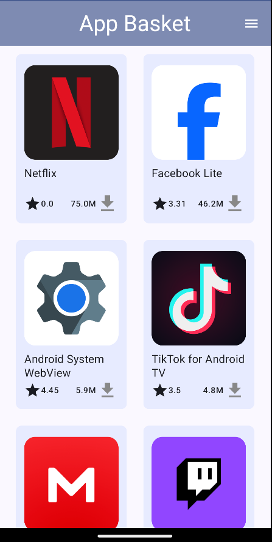
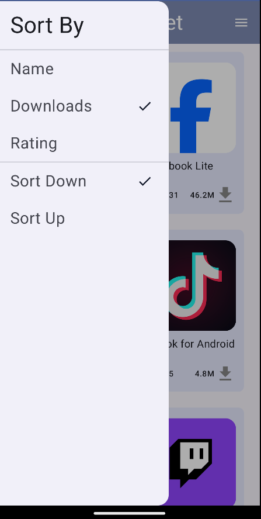
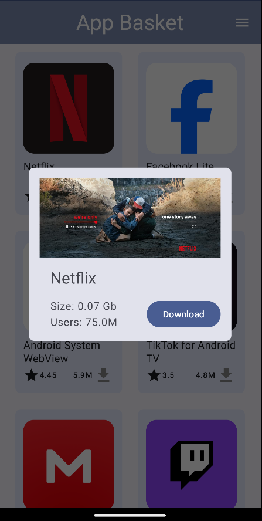
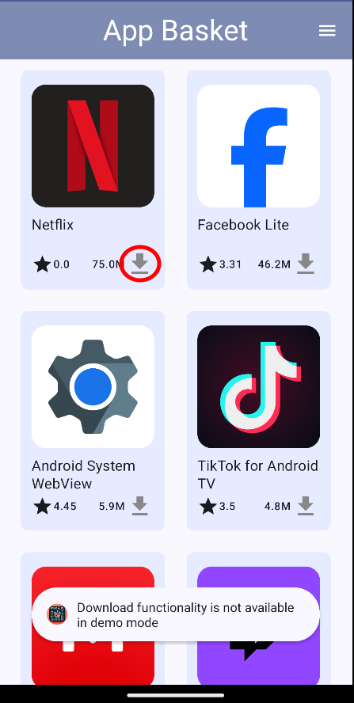
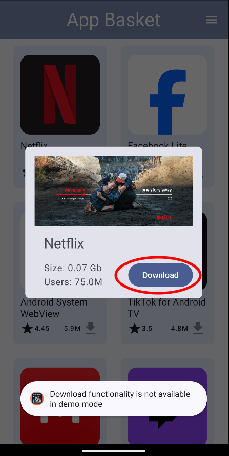

# App Basket 🧺

Welcome to App Basket! This app provides you with access to the most trending apps of the moment.

## Features

### App List
- **Browse Trending Apps**: Navigate through a list of exciting new apps.
- **Customize Listing**: Press the icon in the top right corner to customize the order of the app listing.

  
  

- **Works Offline**: Don't miss the opportunity to check your app list even without an internet connection. App Basket will store your last list in memory.

### App Details
- **Detailed Information**: Tap on any app to gather more information about it.

### Updates Reminder
- **Stay Informed**: Get notified whenever new apps are available on App Basket.

### Download Your Favorite Apps (Coming Soon)
- **Easy Downloads**: Download apps either from the App List or the App Details screen.

  
  

## Architecture

This app is built on two major architectural principles:
### [Model-View-ViewModel (MVVM)](https://en.wikipedia.org/wiki/Model%E2%80%93view%E2%80%93viewmodel) 

This pattern facilitates the separation of development concerns, particularly between graphical interface and the Model that comes from the busisness logic.
  

  - **Model**: Represents the data and business logic of the application. It notifies the ViewModel of any data changes, ensuring the app always displays the most current data.
- **View**: Displays the data and sends user actions to the ViewModel. It observes the ViewModel and updates the UI in response to data changes.
- **ViewModel**: Acts as a bridge between the View and Model. It retrieves data from the Model and processes it for display in the View. The ViewModel also handles user input from the View and updates the Model accordingly.

### [Clean Architecture](https://developer.android.com/topic/libraries/architecture/)

This pattern is not specific to Android but can be applied to various software development projects, including Android app development. Clean architecture helps to keep the application robust, testable, and maintainable. 

The main idea behind Clean Architecture is to create a modular and maintainable codebase by organizing the code into distinct layers or components, each with its own responsibilities and dependencies. This project configuration can be abstracted with the following flowchart:

The three main components are:
* **Data Layer**: The Data Layer is responsible for managing data and interacting with data sources. In this project there are two data sources: The local data base for persistency purposes (implemented with the [Room](https://developer.android.com/jetpack/androidx/releases/room) library); And a network Rest API (implemented with [Retrofit]([https://developer.android.com/jetpack/androidx/releases/room](https://square.github.io/retrofit/)).
  In the data layer it is also present a repository to act as bridge between both data sources and the rest of the app.
* **Domain Layer**: The Domain Layer contains the core business logic (present in the Usecase) and rules of the application. It is independent from the UI and external frameworks. Repository is also used here with the purpose of implementing the repository interface used in the data layer.
* **Presentation Layer**: The Presentation Layer is responsible for rendering the user interface (UI) and handling user interactions. In this layer the viewmodel holds states and reacts to changes propagating them to the activities composables.

## Used Technologies:
* [Retrofit](https://square.github.io/retrofit/) a REST Client for Android which makes it relatively easy to retrieve and upload JSON (or other structured data) via a REST based webservice.
* [Dagger Hilt](https://dagger.dev/hilt/) for dependency injection.
* [Material Design](https://material.io/develop/android/docs/getting-started/) theme configured with, [Material Theme Builder](https://material-foundation.github.io/material-theme-builder/)
* [Coroutines](https://kotlinlang.org/docs/reference/coroutines-overview.html) used to manage the local storage i.e. `writing to and reading from the database`.
* [Room](https://developer.android.com/topic/libraries/architecture/room) persistence library which provides an abstraction layer over SQLite to allow for more robust database.
* [Jetpack Compose](https://developer.android.com/develop/ui/compose) for building the app's UI.
* [Coil](https://coil-kt.github.io/coil/) An image loading library for Android backed by Kotlin Coroutines
* 
## Future improvements 
This section intends to pinpoint some improvements that due to the lack of time were not implemented.
- **Testing**: Testing is imperative as a standard of quality, since it increases drastically the stability of any project. The main types of testing I would apply to this project would be: Unit testing, UI testing and Integration testing.
- **Single-Activity architecture**: This pattern where the app is built around one activity that serves as a container for all the UI components. Instead of switching between multiple activities, the app transitions between different screens or composables within the same activity. Navigation is handled using the [Android Jetpack Navigation Component](https://developer.android.com/guide/navigation). This strategy improve performance, simplifies the navigation and improves testability.
- **Frequent Local Database update**: A job to frequently update the local database is currently missing and needs to be implemented.
- **Material Theme**: Customization could be more extensive.
